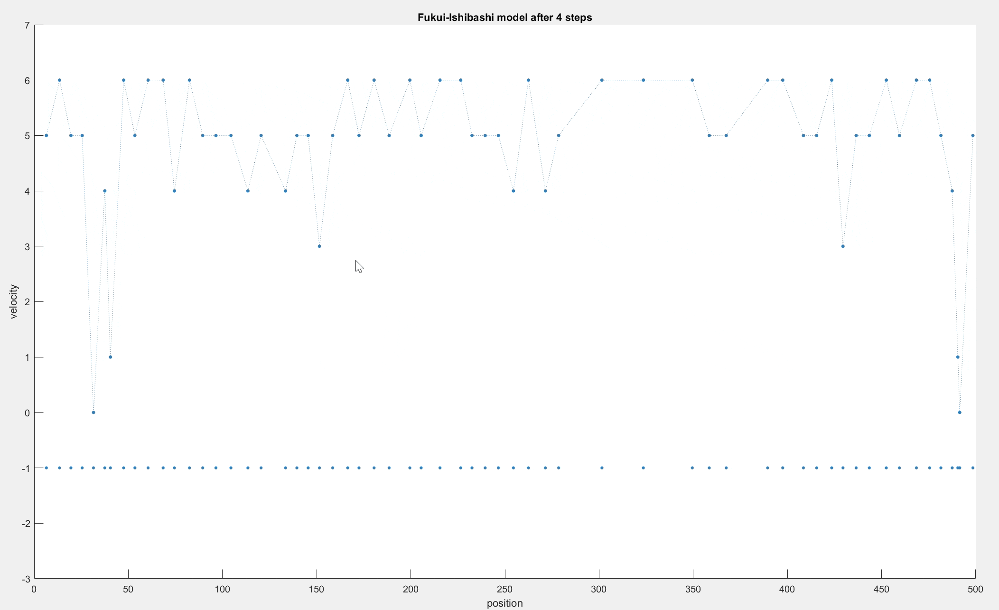
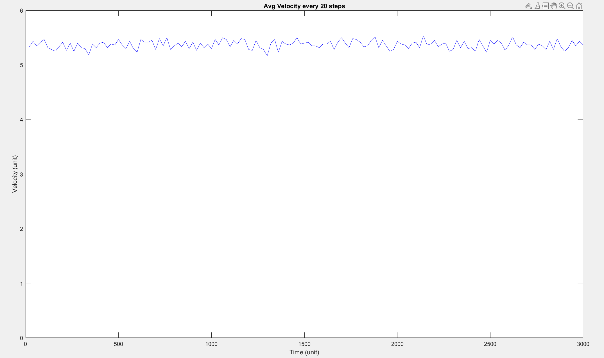
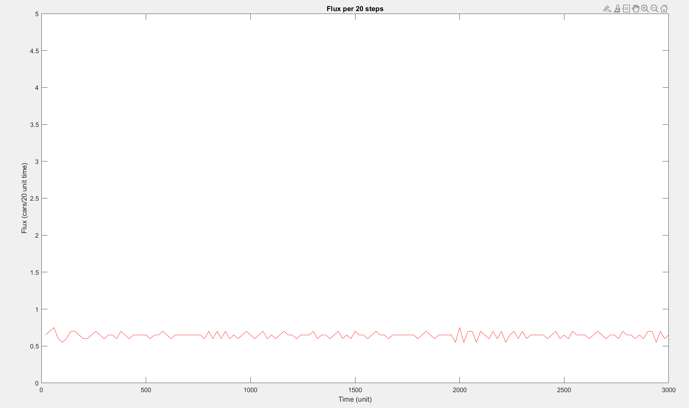
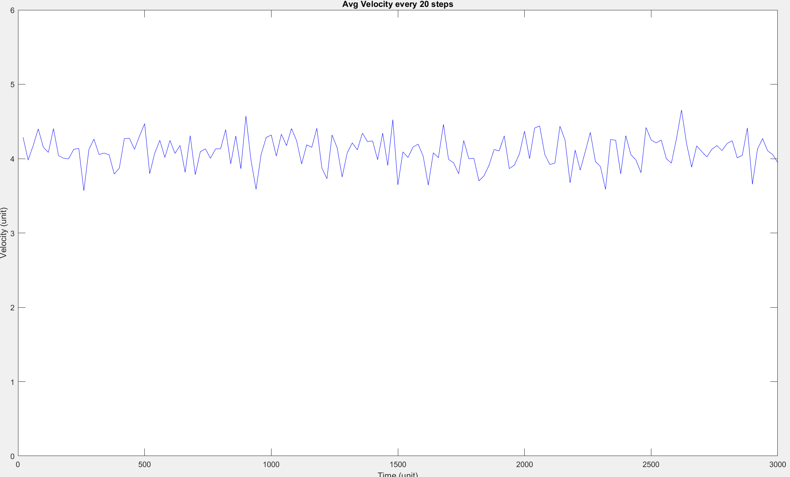
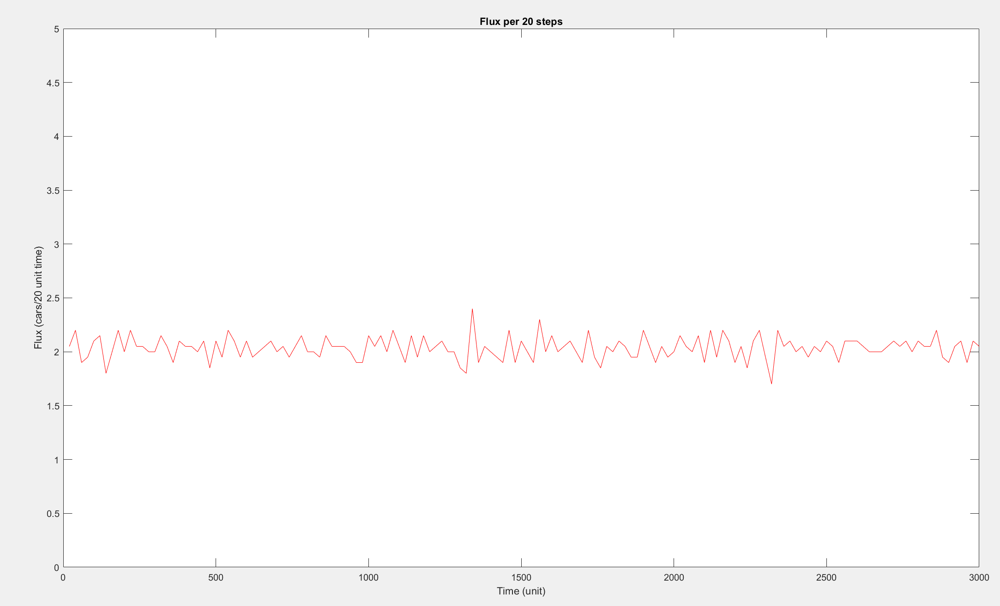
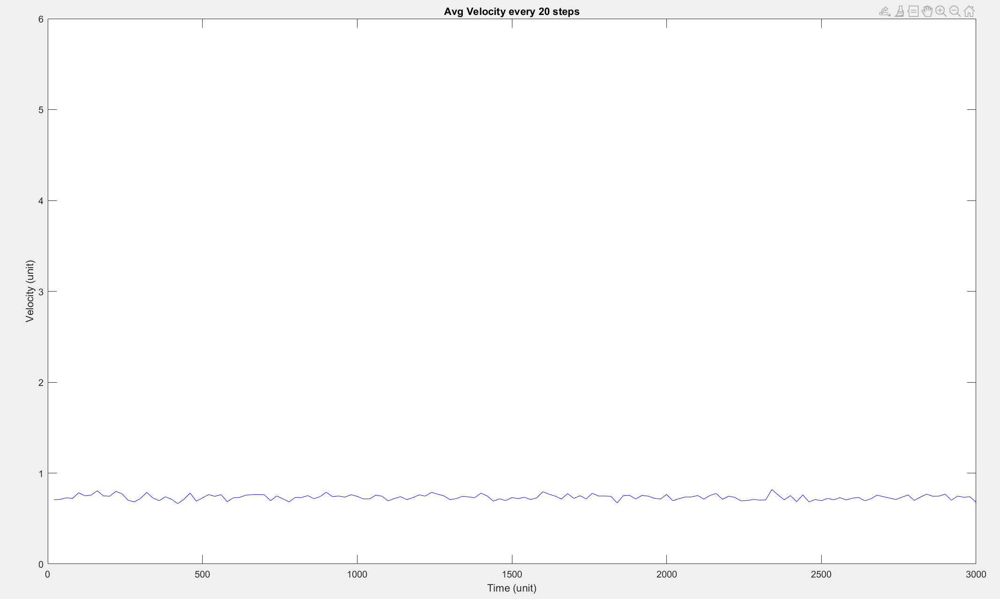
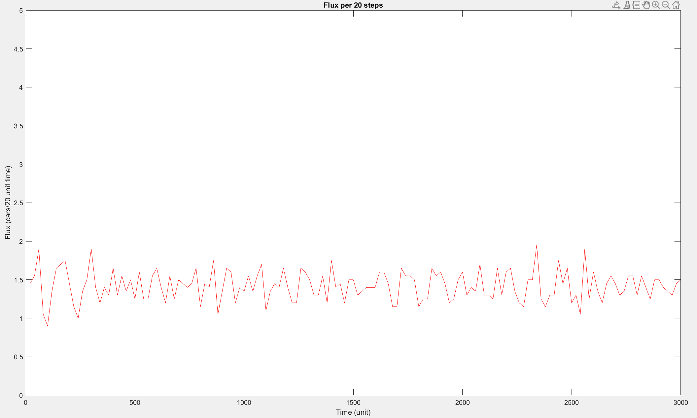

## Introduction

Traffic flow is a complex and dynamic phenomenon that has a significant impact on transportation systems and the economy. As cities grow and traffic congestion becomes more severe, there is a growing need for effective strategies to manage traffic flow. The Fukui-Ishibashi cellular automaton model is a popular and widely used agent-based model for simulating traffic flow. This model takes into account the interactions between individual vehicles, and can be used to predict traffic patterns under different conditions such as varying traffic volumes or road layouts. It also allows easy-to-change driver behavior such as random slow downs or lane changes. We will investigate a modified version of the Fukui-Ishibashi model and its effectiveness in simulating traffic flow under different scenarios, as well as its potential for use in real-world transportation systems. We will also discuss the limitations of this model and identify areas for further research and development.

## Methods

There are a lot of assumptions baked into this model. Unfortunately, traffic systems in the real world are extremely complex. An entire paper could be written on just a driver's behavior, and that doesn't even take into account things like car model, destinations, multi-road systems- there is so much that can be added to a traffic model to simulate reality. My model takes a lot of inspiration from the Nagel-Schreckenberg model that was covered in class, with some important modifications. In this simplified cellular automaton model, agents consist of 'unit' vehicles on a road. These vehicles follow some simple update rules moving left to right, and uses periodic boundary limits to wrap cars off the right side of the screen back to the left. There also exists the notion of lanes, meaning cars can exist parallel to each other as long as they are in different lanes.

#### Update Rules
1. `All agents accelerate to v_max`
2. `Agents lane change with probability p_change and choose 'up' or 'down' with probability 50%`
3. `Slow down if car in front is close`
4. `Stochastically deccelerate`
5. `Move forwards = velocity`
6. `Account for boundary`

As you can see, the update rules are very simple. The most important choice of update rule is the first step, where each agent accelerates to max velocity. This allows the model to achieve 'optimal' traffic flow very easily. Since agents are always going as fast as allowed, they accelerate out of traffic jams very efficiently. It is expected that in low-density situations this model will always perform, so it is of interest what happens in high-density situations.

#### Plotting

The plotting for this model is basically a carbon copy of the plotting done by Professor Seibold in his implementation of Nagel-Schreckenberg, with an important change- the support for n-lanes. Each lane is plotted below the x axis at y = -1, y = -2 etc. To match the lanes to the velocities, a color generating function found [here](https://www.mathworks.com/matlabcentral/fileexchange/42673-beautiful-and-distinguishable-line-colors-colormap) was used to generate the colors. This function was extremely useful, as it made separating the lanes very easy. I was worried that I would have to plot each lane as a subplot, which would have significant performance impact and also limit the number of lanes much more than the current implementation.

## Results

First, lets take a look at how this model handles the most basic traffic system- a single road, 50% slowdown chance, relatively low car density.

In this situation, the model quickly reaches equilibrium. Since there are no lane changes, the model does not have any interruptions and remains this way until the simulation ends. Clearly, this traffic model performs extremely well for low density, single-lane traffic. I expect this is because of the semi-unrealistic assumption that drivers will always attempt to drive at v_max. What happens when we expand this simulation to multiple lanes?

Here we can see much more traffic jams than before. This is caused primarily by the lane changes- everyone keeps cutting each other off! Since the logic for lane changes only checks if a car is directly in the space next to the agent, cutoffs are very frequent. But, since each agent accelerates out of the jam immediately, the jam evaporates quickly. Most drivers would probably be more frustrated in these conditions, since the flow is start-stop and there are frequent slowdowns, compared to our original model where the flow was very uniform. Lets compare these two situations using two very basic metrics- average velocity and flux per 20 steps.

| Average Velocity                          | Flux                            |
| ----------------------------------------- | ------------------------------- |
|          |   |
|  |  |

Before I ran this simulation, I expected the first set of parameters to have both a higher average velocity and a higher flux. However, we see the single-lane simulation hovering just above 0.5 cars per 20 time steps, and the 4-lane simulation sits right above 2 cars/20ts, or roughly 4x. This was surprising to me at first, as I assumed a higher average velocity would lead to agents more quickly traversing the entire road and thus increase the flux. The increase in flux must then be due to the lane increase. In the original simulation the single lane is a bottleneck for how many cars can pass through. In the second simulation, we now have 4x the 'area' that agents can pass through for the purposes of our flux calculation. In fact, the original simulation hovers just above 0.5 cars/20ts, and the second hovers just above 2 cars/20ts, or roughly 4x! So, even though the second sim has much lower average velocity, the increase in lanes more than makes up for the constant slowdowns. Then this begs the question- does this hold as we increase the density of cars on the road?

| Average Velocity | Flux |
| ---------------- | ---- |
|                  |      |

In this simulation, we quadrupled the number of cars on the road. The reason we multipled by 4 was to simulate the density of the single lane simulation over 4 lanes to see how the model performed. Clearly, the driving experience was terrible. With an average velocity below 1 at every sample step, we can confidently say this road is bumper-to-bumper throughout the simulation. However, the flux still oscillates above the single lane road, staying between 1-2 cars/20ts. So, even with completely jammed lanes, the multi-lane road still produces much more throughput than a single lane road.

## Conclusion

Under this modified FI traffic model, it is clear that to maximize the flow of traffic through a given area, blindly increasing the number of lanes will work. However, this comes at the cost of a terrible driving experience for those on the road. Even though over time there are more agents passing through the road, the constant start-stop and extremely low average velocity make for what I like to call an "Office Space" commute. There are plenty of examples in the real world where more lanes add more complexity and result in terrible traffic reputations (Houston, LA for example). However, I am very interested in whether or not these reputations are the exact phenomena that I have discovered here- sacrificing driver satisfaction for a higher overall flow. My prediction is that there are much more complex systems at play in these cities as they are not a unidirectional periodic road, but it is interesting to think about.

As much as I enjoyed working on this model, it leaves a lot to be desired in terms of complexity. Like most cellular automata, all agents are subject to the same rule, leaving simulation variance up to some series of probabilities. In future iterations, it would be very interesting to develop several classes of drivers, where each class has some variation of driver behavior assigned to it. As well as this, the lane change logic is extremely removed from reality. Drivers don't usually lane change for no reason, so building up some kind of realistic lane change logic would be a great way to bring this model closer to reality. Finally, this model assumes all cars to be uniform size, acceleration, top speed, and does not account for things like speeding or illegal overtakes. 

## References

Here is a list of links to various articles, research papers, and videos that I looked at throughout this project. I did not incorporate everything from all of these resources, but I figured they would be of interest to anyone who wanted to learn more about traffic modelling.

[A Review of Traffic Simulation Software, by G. Kotusevski and K.A. Hawick](https://mro.massey.ac.nz/bitstream/handle/10179/4506/TrafficSimulatorReview_arlims.pdf?sequence=1&isAllowed=y)

[Research on critical characteristics of highway traffic flow based on three phase traffic theory](https://www.sciencedirect.com/science/article/abs/pii/S0378437119309276) - A paper about the Kerner-Klenov-Wolf cellular automaton model

[Cellular automata approach to three-phase traffic theory](https://iopscience.iop.org/article/10.1088/0305-4470/35/47/303/meta) - Another paper on KKW

[Speed / Density / Flow Relationships | NCEES Civil Engineering PE Exam \[Section 5.1.1.4; 5.1.2\]](https://www.youtube.com/watch?v=DmrmtYLabrI)

[Ultradiscrete optimal velocity model: A cellular-automaton model for traffic flow and linear instability of high-flux traffic](https://journals.aps.org/pre/pdf/10.1103/PhysRevE.79.056108)

[Exact results of 1D traffic cellular automata: The low-density behavior of the Fukui–Ishibashi model](https://www.sciencedirect.com/science/article/pii/S0378437117312438) - Fukui-Ishibashi Model